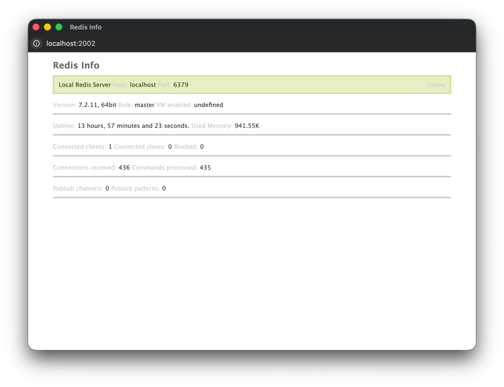

Redis Info
==========



Redis Info is an easy to configure, web-based realtime monitoring tool for Redis servers written in PHP.
 It provides nice front-end for access to statistics and server status.

## Installing
Download and place all files to your webserver.

It needs at least PHP `>=5.2` with `ext-json` installed.

## Configuration

You can add or edit your Redis servers using `config.ini` file.

An example configuration file looks like this:

```ini
[Node 76]
host = node-76.redis-server
port = 6379
auth = password

[Master]
host = redis-server-master-ip
port = 6501
auth = foobared
```

## Starting

Start a local PHP webserver with the following command:

```bash
php -S localhost:2002 -t /Users/u12021/Projects/redis-info
```

## Bookmarklet

The following JS code can be used as a bookmarklet script, to open a monitoring popup.

```js
javascript:/* * Redis Info popup bookmarklet. * * Copyright (c) 2025 Marcel Romeike */ (function (window){var windowWidth = 900;var windowHeight = 600; window.open('http://localhost:2002','redis-info',[ 'popup=yes',`left=${(window.outerWidth / 2) + window.screenX - (windowWidth / 2)}`,`top=${(window.outerHeight / 2) + window.screenY - (windowHeight / 2)}`,`width=${windowWidth}`,`height=${windowHeight}`,'menubar=no','toolbar=no','location=no',].join(','));})(window);
```
